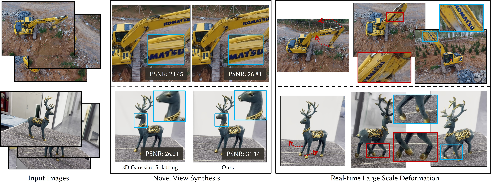
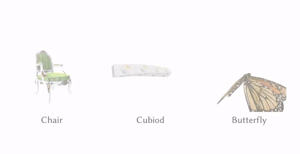

# Real-time Large-scale Deformation of Gaussian Splatting

This repository contains the implementation with jittor for paper "Real-time Large-scale Deformation of Gaussian Splatting".



Video Demo


## Set-up

### Basic Requirements
```
CUDA>=11
g++
```
### Conda
```
conda create -n jittor-gaussian python=3.9
conda activate jittor-gaussian
python3.9 -m pip install jittor
python -m pip install libigl
pip install cmake plyfile tqdm icecream
```
### Compile the submodules
The simple-knn and diff_gaussian_rasterizater modules should be compiled with cmake and make:
```
cd gaussian-renderer/diff_gaussian_rasterizater
cmake .
make -j
cd ../../scene/simple-knn
cmake .
make -j
```
You will get simpleknn.so and CudaRasterizer.so in simple-knn and diff_gaussian_rasterizater folders. 

The ACAP modules should be compiled:

```
cd ACAP
unzip pyACAPv1.zip
chmod +x install_OpenMesh.sh
install_OpenMesh.sh
python setup.py install
```

### Download

- [MeshFix](https://github.com/MarcoAttene/MeshFix-V2.1.git)
- A mesh reconstruction method: [instant-nsr-pl](https://github.com/bennyguo/instant-nsr-pl.git)(faster but need extra code to convert mesh back to the original space if use the colmap dataset) or 3D-GS based method （reference [here](mesh_preprocess/README.md)）

### LPIPS

The repository uses [Jittor_Perceptual-Similarity-Metric](https://github.com/ty625911724/Jittor_Perceptual-Similarity-Metric) for evaluation. Please download the pretrained model following the origin repository and put the weight file in lpips_jittor folder. 

## Get Starting
### 0.Example

There is an example of final directory:

```
<gaussian-mesh-splatting>
|---data
|   |---<garden>
|   |   |---sparse
|   |   |---images
|   |   |---masks(no need if without background)
|   |   |---mesh_sequnce
| 	|   |   |---1.obj (origin mesh)
| 	|   |   |---2.obj (deformed mesh)
| 	|   |   |---3.obj (deformed mesh)
| 	|   |   |---...
|---output
|   |---<graden>
|   |   |---deform (final results directory)
|   |   |---point_cloud/iteration_30000
|	  |   |   |---point_cloud.ply
|   |   |	  |---bg_point_cloud.ply
|   |   |---cameras.json
|   |   |---...
|---mesh_preprocess
|   |---<your mesh reconstruction method>
|   |---MeshFix
|---train.py
|---render.py
|---edit.py
|---...
```

Given the example command:

```python
# with background
python train_mesh_gaussian.py -r 1 -s data/excavator -m output/excavator  --is_exist_bg --input_mesh data/mesh_sequnce/1.obj

python train_bg_gaussian.py -r 1 -s data/excavator -m output/excavator \
--mesh_gaussian_path output/excavator/point_cloud/iteration_30000/point_cloud.ply  --is_exist_bg

python render.py -s data/excavator -m output/excavator --eval

python edit.py --camera_path output/excavator --object_name excavator \
--object_gaussian output/excavator/point_cloud/iteration_30000/point_cloud.ply \
--object_origin_mesh data/mesh_sequnce/1.obj \
--object_deform_mesh data/mesh_sequnce/4.obj \
--render_path output/excavator/deform \
--is_exist_bg --background_gaussian output/excavator/point_cloud/iteration_30000/bg_point_cloud.ply

# without background
python train_mesh_gaussian.py -s data/excavator -m output/excavator --input_mesh data/mesh_sequnce/1.obj

python render.py -s data/excavator -m output/excavator --eval

python edit.py --camera_path output/excavator --object_name excavator \
--object_gaussian output/excavator/point_cloud/iteration_30000/point_cloud.ply \
--object_origin_mesh data/mesh_sequnce/1.obj \
--object_deform_mesh data/mesh_sequnce/4.obj \
--render_path output/excavator/deform
```


### 1.Preparation 

- Multi-View dataset format shows as follows:

  ```
  DATA_NAME
  |---- images                 (the same as Vanilla Gaussian Splatting)
  |---- sparse/XXX.json        (the same as Vanilla Gaussian Splatting)
  └---- mask                   (need mask if you want to edit the object with bg,or you should delete this                                   folder)
  ```

- Reconstruct proxy mesh

  You can use any reconstruction method to obtain the proxy mesh. It is recommended using [instant-nsr-pl](https://github.com/bennyguo/instant-nsr-pl.git) for reconstructing proxy meshes  in just 10k epoch.

  Make sure the proxy mesh is converted back to the original space.(The mesh is often normalized if use the colmap dataset)

- Mesh preprocessing

  - It is hard to deform the high resolution mesh by using ARAP. Simplify the mesh (10-20K faces) by MeshLab.

  - ACAP is not work if mesh has some artifacts(holes,self-intersections)Please Use MeshLab manually or MeshFix automatically.

- Mesh Deformation

  Peform simple ARAP deformation by function igl.ARAP or other tools.

### 2.Training

#### Deform an object without background

```python
python train_mesh_gaussian.py -r 1 -s <path to COLMAP or NeRF Synthetic dataset> -m <output_path>\
--input_mesh <mesh_path> 
```

#### Deform an object with background

```python
python train_mesh_gaussian.py -r 1 -s <path to COLMAP dataset> -m <output_path>  --input_mesh <mesh_path>\
--is_exist_bg
python train_bg_gaussian.py -r 1 -s <path to COLMAP dataset> -m <output_path> --mesh_gaussian_path <output_path>/point_cloud/iteration_30000/point_cloud.ply  --is_exist_bg
```

### 3.Rendering & Evaluation

```shell
python render_origin.py -m <output_path> -s <dataset_path>
python metrics.py -m <output_path> 
```

### 4.Editing Gaussian
Use **edit.py** to deform gaussians:
<details>
<summary><span style="font-weight: bold;">Available parameters </span></summary>

  #### camera_path
  the same with output path!!!
  #### object_name 
  any name you want.It is mainly uesd in multi objects deformation in the same scene.
  #### object_gaussian
  mesh_based_gaussian_model(ply format)
  #### object_origin_mesh
  mesh before deformation,the same as the input mesh in training(obj format)
  #### object_deform_mesh
  deformed mesh(obj format)
  #### render_path
  saved path(custom format)
  #### is_exist_bg(Used in scene deformation)
  If you want to deform objects with the scene, use it.
  #### background_gaussian(Used in scene deformation)
  the background gaussian_model(ply format)

</details>
<br>

This is a script of rendering one deformation with training/testing json(or generating circle poses):

**Deform an object without background**

```python
python edit.py --camera_path <output_path> --object_name <any name> --object_gaussian <output_path>/iteration_30000/point_cloud.ply \
--object_origin_mesh <output_path>/proxy_mesh.obj \
--object_deform_mesh <output_path>/deform_mesh.obj \
--render_path <output_path>/deform
```

**Deform objects with background**

```python
python edit.py --camera_path <output_path> --object_name <any name> --object_gaussian <output_path>/iteration_30000/point_cloud.ply \
--object_origin_mesh <output_path>/proxy_mesh.obj \
--object_deform_mesh <output_path>/deform_mesh.obj \
--render_path <output_path>/deform \
--is_exist_bg --background_gaussian /<output_path>/iteration_30000/bg_point_cloud.ply
```

**You can also make an animation (like flying butterfly) Reference comment code in "edit.py".**




<!-- ## Plan of Models

- :clock3:More trained gaussian deformation demo

- :clock3: Pytorch Implementation

-  :heavy_plus_sign: More application(Avatar body ,face ,hand) -->

  

## Acknowledgements
The original implementation comes from the following cool project:
* [3DGS](https://github.com/graphdeco-inria/gaussian-splatting/)
* [gaussian-splatting-jittor](https://github.com/otakuxiang/gaussian-splatting-jittor.git)
* [Jittor-LPIPS](https://github.com/ty625911724/Jittor_Perceptual-Similarity-Metric)
